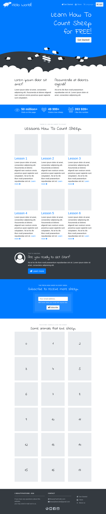
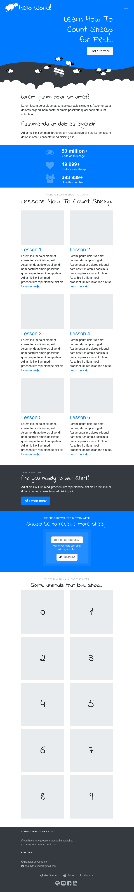
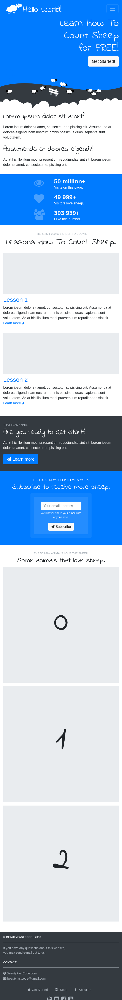

# Project Sheep - Fully Responsive HTML5 One-Page Website Template.

---

## Live demo on GitHub Pages.

- [Click this link](https://beautyfastcode.github.io/sheep/). 

---

## Technologies used.

List of tools used to build this project:

- [`Yarn`](https://yarnpkg.com) - dependency management for [`node.js`](https://nodejs.org) the JavaScript runtime,
- [`Git`](https://git-scm.com/) - version control system,
- [`PhpStorm`](https://www.jetbrains.com/phpstorm/) - Lightning-smart PHP IDE,
- [`Gulp.js`](https://gulpjs.com/) - toolkit for automating painful or time-consuming tasks in your development workflow,
    - transforms `SCSS` files to `CSS`,
    - transforms `Pug` files to `HTML`,
    - copy assets and libraries to build folder,
    - downloads desired fonts from `Google fonts`,
    - runs `LiveReload` server,
    - etc.   
- [`Bootstrap 4`](https://getbootstrap.com/) - `HTML` and `CSS` front-end framework for build responsive, mobile-first projects, 
    - with JavaScript libraries `jquery` and `popper.js`,
- [`Pug`](https://pugjs.org/) - template engine for `Node.js` and browsers,
- [`Sass`](https://sass-lang.com/) - syntactically awesome style sheets, preprocessor for `CSS`, 
- [`Font Awesome 4.7`](https://fontawesome.com/v4.7.0/) - scalable vector icons,
- [`Indie Flower`](https://fonts.google.com/specimen/Indie+Flower) - custom Google font, 
- [`Gravit Designer`](https://www.designer.io/) -  cross-platform vector design app,
- [`SVG`](https://www.w3schools.com/graphics/svg_intro.asp) - stands for Scalable Vector Graphics,
- `Firefox` and `Chrome` - web browsers,
- [`Kubuntu`](https://kubuntu.org/) - operating system.

---

## Screenshots.

1 | 2 | 3 | 4
------|------|------|------
 |  |  | 

---
